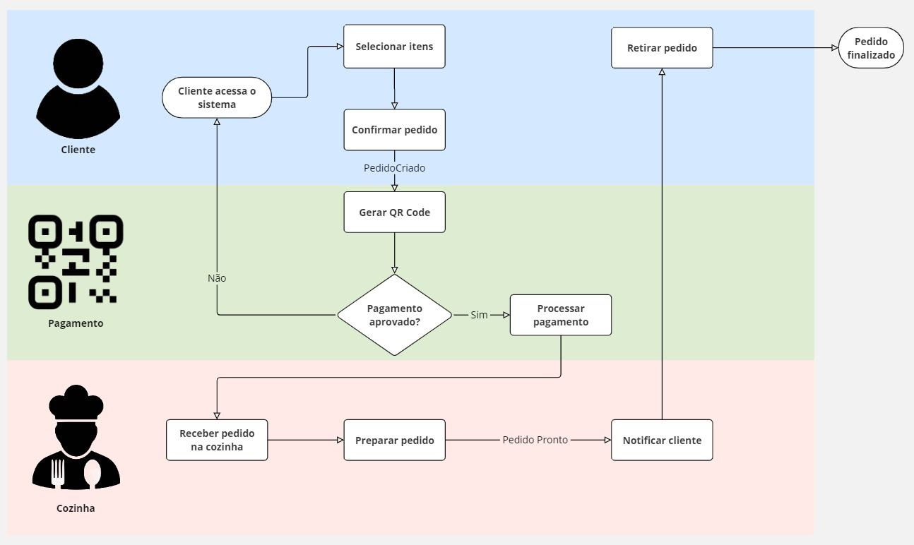
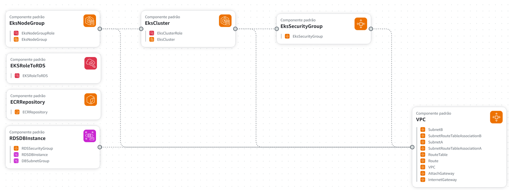
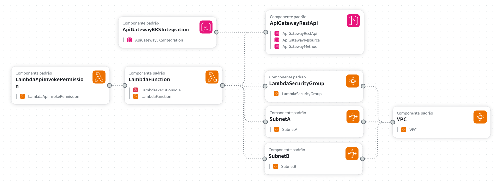
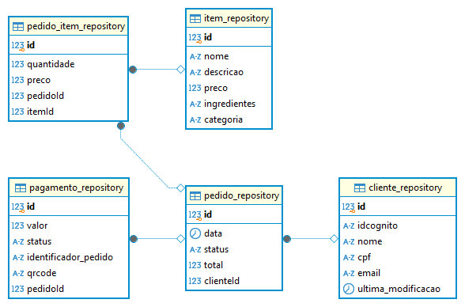

# Lanchonete API - Pós-Tech FIAP - Arquitetura de Software

Este repositório contém o código-fonte para a API backend de uma lanchonete, desenvolvido durante o primeiro módulo da Pós-Tech FIAP de Arquitetura de Software. O projeto foi criado utilizando a metodologia Domain Driven Design (DDD) e princípios de Clear Archtecture, com o objetivo de criar um sistema escalável e testável.

## Fluxograma do projeto e problema resumido
Uma lanchonete de bairro que está expandindo enfrenta desafios com a organização dos pedidos devido à ausência de um sistema de controle. Isso pode causar confusões e atrasos, com pedidos sendo perdidos ou preparados incorretamente, resultando em insatisfação dos clientes. Um exemplo claro é um cliente que faz um pedido complexo e personalizado que pode ser mal interpretado quando passado manualmente para a cozinha.

A falta de um sistema adequado pode prejudicar seriamente a eficiência operacional da lanchonete, especialmente durante a expansão. Sem um controle sistemático de pedidos e estoques, o risco de erros aumenta, podendo levar a perdas de negócio e clientes insatisfeitos. É evidente que a implementação de um sistema de controle de pedidos é crucial para manter a qualidade do serviço e a satisfação do cliente.

Para resolver essa questão, a lanchonete planeja implementar um sistema de autoatendimento, permitindo que os clientes façam pedidos por meio de interfaces interativas sem a necessidade de interação direta com atendentes. Este sistema incluirá funcionalidades para pedidos, acompanhamento e pagamento via QR Code do Mercado Pago, garantindo que o cliente possa acompanhar o andamento de seu pedido em tempo real desde a recepção até a finalização.

Além das interações com o cliente, o sistema oferecerá recursos administrativos para a gestão de clientes e produtos. Isso incluirá a capacidade de gerenciar categorias de produtos como lanches, bebidas, acompanhamentos e sobremesas, além de acompanhar pedidos em andamento. Esta estrutura não só otimiza o fluxo de trabalho como também facilita campanhas promocionais direcionadas, baseadas na identificação e preferências dos clientes.

### Fluxograma do atendimento do problema


## Tecnologias Utilizadas

- **TypeScript**: Linguagem de programação.
- **PostgreSQL**: Sistema de gerenciamento de banco de dados.
- **Docker**: Ferramenta de virtualização e orquestração de containers.
- **Docker Compose**: Ferramenta para orquestrar múltiplos serviços Docker.
- **Swagger**: Ferramenta de documentação de APIs.
- **TypeORM**: ORM (Object-Relational Mapping) para qualquer banco de dados.
- **Amazon EKS**: Ferramenta de orquestração de kubernetes
- **Código QR Mercado Pago**: Desenvolvimento da integração com o mercado pago para geração de QR-Codes e captura do pagamento
- **AWS Lambda**: Serviço de computação serverless que executa código em resposta a eventos, sem necessidade de gerenciar servidores.
- **API Gateway**: Serviço gerenciado que permite criar, publicar e gerenciar APIs seguras e escaláveis para acessar aplicações backend.

## Estrutura do Projeto

A estrutura segue o padrão Clean Architecture, focando em uma separação clara entre as regras de negócio e a infraestrutura:

1. **Domain**
   1. **Entities**
      - Classes que representam os domínios do negócio (Cliente, Item, Pedido, Pagamento).
   2. **DTOs**
      - Interfaces de transferência de dados entre gateways.

2. **Application**
   1. **Interfaces**
      - Interfaces de implementação e dados
   2. **Use Cases**
      - Contém a lógica de aplicação, orquestrando o fluxo de dados para e das entidades.

3. **infra**
   1. **Database**
      - Contém as configurações de banco de dados e estrutura de tabelas
   2. **HTTP**
      - Rotas e os controladores
   3. **Mercado Pago**
      - Classe de implementação da conta de testes do Mercado Pago

### Princípios SOLID Aplicados

- **Single Responsibility Principle (SRP)**: Cada módulo ou classe tem responsabilidade única.
- **Open/Closed Principle (OCP)**: Entidades e use cases são abertos para extensão, mas fechados para modificação.
- **Liskov Substitution Principle (LSP)**: Objetos substituíveis por instâncias de seus subtipos.
- **Interface Segregation Principle (ISP)**: Muitas interfaces específicas são melhores do que uma interface única.
- **Dependency Inversion Principle (DIP)**: Dependência de abstrações, não de implementações concretas.

## Arquitetura AWS para o Kubernetes


### Descrição
A arquitetura visa permitir que uma aplicação TypeScript que roda em um cluster EKS, se conecte a um banco de dados RDS PostgreSQL e utiliza o ECR para gerenciar as imagens Docker.

Esta arquitetura foi projetada para ser escalável, segura e fácil de gerenciar.

#### VPC
Primeiro, temos a VPC, ou Virtual Private Cloud. Ela cria uma rede virtual isolada na nuvem, onde podemos lançar nossos recursos AWS. Isso nos dá controle total sobre a configuração da rede, incluindo sub-redes, tabelas de roteamento e gateways de internet.

#### Subnets
Dentro da VPC, temos subnets. Elas dividem a VPC em segmentos menores e permitem isolar recursos em diferentes zonas de disponibilidade. Isso ajuda a aumentar a resiliência e a disponibilidade de nossa aplicação.

#### Internet Gateway e Route Table
Para conectar nossos recursos à internet, usamos um Internet Gateway. Ele é anexado à VPC e, juntamente com a tabela de rotas, direciona o tráfego de rede para fora e para dentro da nossa rede.

#### Security Groups
Usamos grupos de segurança para controlar o tráfego de rede:

O grupo de segurança do EKS controla o tráfego de entrada e saída para o cluster EKS.
O grupo de segurança do RDS controla o tráfego para a instância do banco de dados PostgreSQL, permitindo apenas conexões específicas.

#### EKS Cluster
O cluster EKS gerencia nossos contêineres usando Kubernetes. Ele agrupa contêineres em pods e nós, escalando e gerenciando a infraestrutura subjacente automaticamente. O papel IAM do cluster permite que ele acesse e controle outros recursos AWS necessários.

#### RDS Database
A instância RDS gerencia nosso banco de dados PostgreSQL. Isso facilita a configuração, operação e escalabilidade do banco de dados na nuvem. Definimos sub-redes específicas para isolar e proteger a instância RDS. Mas para ter controle do que se está sendo gravado e caso a banca avaliadora queira visualizar os dados, o mesmo está temporariamente público

#### ECR Repository
Por fim, o ECR armazena e gerencia nossas imagens Docker. Ele permite que enviemos nossas imagens Docker para a AWS e as utilizemos em diferentes serviços, como o EKS, facilitando a implantação da nossa aplicação.

### Arquitetura do Módulo 3


Para esta arquitetura, como uma evolução da pós-graduação, foi adicionado uma função Lambda para criar um formulário de criação e login de usuários, agora gerenciados pelo AWS Cognito. Seguindo a premissa de que o usuário pode também não se identificar para gerar um pedido.

E para criar uma estrutura de segurança, tanto para o Kubernetes criado pelo módulo anterior quanto para o Lambda, foi criado um API Gateway para permitir acesso apenas a usuários cadastrados do sistema.

### AWS Cognito
O AWS Cognito é um serviço de autenticação e gerenciamento de identidades da AWS que facilita o registro, login e controle de acesso para aplicações web e móveis. Ele permite gerenciar usuários e autenticar-se diretamente ou através de provedores de identidade externos, como Google, Facebook, Apple e SAML. Cognito também oferece recursos como autenticação multifator (MFA), verificação de e-mail e número de telefone, além de integração com serviços da AWS para controle de acesso baseado em permissões. Ele simplifica a implementação de segurança e gerenciamento de identidades de maneira escalável e segura.

#### AWS Lambda
O AWS Lambda é um serviço de computação serverless da AWS que permite executar código em resposta a eventos sem a necessidade de provisionar ou gerenciar servidores. Ele suporta várias linguagens de programação, como Python, Node.js, Java, entre outras. O Lambda escala automaticamente com base na carga de trabalho e cobra apenas pelo tempo de execução do código, tornando-o uma solução eficiente em termos de custo. Ele pode ser acionado por eventos de diversos serviços da AWS, como S3, DynamoDB, API Gateway, entre outros, tornando-se uma ferramenta poderosa para aplicações orientadas a eventos e microserviços.

#### AWS API Gateway
O AWS API Gateway é um serviço gerenciado da AWS que facilita a criação, publicação, manutenção, monitoramento e segurança de APIs em escala.

Ele atua como uma interface entre clientes e serviços backend, permitindo que você exponha funcionalidades e dados de aplicações através de APIs RESTful ou WebSocket.

O API Gateway é altamente escalável e permite que desenvolvedores integrem serviços como AWS Lambda, EC2, ou bancos de dados como RDS de forma simplificada. Ele suporta autenticação, autorização e proteção contra ataques, como DDoS, com integração a serviços como AWS IAM e Amazon Cognito. Além disso, o API Gateway pode gerenciar tráfego de APIs, definir quotas e limites de requisições, e realizar transformações de dados para diferentes formatos de entrada e saída, tornando-se uma solução robusta para construir APIs seguras e escaláveis com facilidade.

## Domínios e Entidades

O sistema inclui as seguintes classes de domínio:

- **Cliente**: Representa um cliente da lanchonete.
- **Item**: Representa um item do cardápio.
- **Pedido**: Representa um pedido realizado pelo cliente.
- **Pagamento**: Representa o pagamento de um pedido.

## Comandos para Inicializar o Serviço na Máquina Local

1. **Clonar o repositório:**
    ```bash
    git clone https://github.com/AfonsoCastro1983/fiap-techchallenge.git
    ```

2. **Instalar as dependências:**
    ```bash
    cd lanchonete-api
    npm install
    ```

3. **Iniciar os serviços Docker:**
    ```bash
    docker-compose up -d
    ```

4. **Acessar a documentação da API Swagger:**
    [http://localhost:8000/docs](http://localhost:8000/docs)

## Acesso à documentação implantada na AWS

Para acessar a documentação **Swagger** deste projeto clique neste [link](https://a6614520a11704e48a4c16e3d10c749c-851906114.us-east-2.elb.amazonaws.com/docs/).

## Endpoints

### Sessão Cliente

O sistema pode iniciar com um cliente ou não. Os endpoints para gerenciamento de clientes são:

- **POST /cliente**: Criação de um novo cliente.
- **GET /cliente/cpf**: Busca de um cliente usando CPF.
- **GET /cliente/email**: Busca de um cliente usando e-mail.

### Sessão Item

Gerencie os itens do cardápio da lanchonete através dos seguintes endpoints:

- **POST /item**: Criação de novos itens.
  - Exemplos de JSON para criação:
    ```json
    {
      "nome": "Hambúrguer Clássico",
      "descricao": "Hambúrguer com queijo, alface e tomate.",
      "preco": 18.50,
      "ingredientes": "Pão, carne, queijo, alface, tomate",
      "categoria": "LANCHE"
    }
    ```
    ```json
    {
      "nome": "Refrigerante",
      "descricao": "Refrigerante gelado de 350ml.",
      "preco": 5.00,
      "ingredientes": "Água, açúcar, gás carbônico",
      "categoria": "BEBIDA"
    }
    ```
    ```json
    {
      "nome": "Batata Frita",
      "descricao": "Batata frita crocante e salgada.",
      "preco": 10.00,
      "ingredientes": "Batata, óleo, sal",
      "categoria": "ACOMPANHAMENTO"
    }
    ```
    ```json
    {
      "nome": "Sorvete",
      "descricao": "Sorvete de chocolate com calda.",
      "preco": 12.00,
      "ingredientes": "Leite, açúcar, cacau",
      "categoria": "SOBREMESA"
    }
    ```
    ```json
    {
      "nome": "Sanduíche Natural",
      "descricao": "Sanduíche natural com frango e salada.",
      "preco": 15.00,
      "ingredientes": "Pão integral, frango, alface, tomate",
      "categoria": "LANCHE"
    }
    ```
    ```json
    {
      "nome": "Suco de Laranja",
      "descricao": "Suco de laranja natural de 300ml.",
      "preco": 8.00,
      "ingredientes": "Laranja",
      "categoria": "BEBIDA"
    }
    ```
    ```json
    {
      "nome": "Anéis de Cebola",
      "descricao": "Anéis de cebola fritos e crocantes.",
      "preco": 12.00,
      "ingredientes": "Cebola, farinha, óleo",
      "categoria": "ACOMPANHAMENTO"
    }
    ```
    ```json
    {
      "nome": "Brownie",
      "descricao": "Brownie de chocolate com nozes.",
      "preco": 9.00,
      "ingredientes": "Chocolate, farinha, ovos, nozes",
      "categoria": "SOBREMESA"
    }
    ```
    ```json
    {
      "nome": "Cheeseburger",
      "descricao": "Cheeseburger com queijo cheddar.",
      "preco": 20.00,
      "ingredientes": "Pão, carne, queijo cheddar, alface",
      "categoria": "LANCHE"
    }
    ```
    ```json
    {
      "nome": "Milkshake",
      "descricao": "Milkshake de morango de 400ml.",
      "preco": 14.00,
      "ingredientes": "Leite, sorvete, morango",
      "categoria": "BEBIDA"
    }
    ```

- **PUT /item**: Alteração de um item.
- **DELETE /item/{id}**: Deleta um item pelo código identificador.
- **GET /item/{categoria}**: Busca de itens por categoria. As categorias são: LANCHE, BEBIDA, ACOMPANHAMENTO e SOBREMESA.

### Sessão Pedido

Gerencie os pedidos da lanchonete através dos seguintes endpoints:

- **GET /pedido/{id}**: Busca de um pedido específico pelo identificador.
- **GET /pedido/listagem/{status}**: Busca de pedidos por status. Os status são: NOVO, ENVIAR_PARA_PAGAMENTO, CANCELADO, ENVIADO_PARA_A_COZINHA, EM_PREPARACAO, PREPARADO, PRONTO_PARA_ENTREGA, ENTREGUE.
- **GET /pedido/{status}**: Busca pedidos pelos status descritos no módulo 2 (Pronto (PRONTO_PARA_ENTREGA) > Em Preparação (EM_PREPARACAO) > Recebido (ENVIADO_PARA_A_COZINHA))
- **POST /pedido**: Criação de um novo pedido. É possível não preencher o número do cliente para casos em que o cliente não quis se identificar. O preço é passado no payload porque o preço pode mudar ao longo da criação do pedido e deve-se manter o preço inicialmente acordado.
- **PUT /pedido/status**: Mudança do status do pedido. Os status são: NOVO, ENVIAR_PARA_PAGAMENTO, CANCELADO, ENVIADO_PARA_A_COZINHA, EM_PREPARACAO, PREPARADO, PRONTO_PARA_ENTREGA, ENTREGUE.

### Sessão Pagamento

Gerencie os pagamentos dos pedidos através dos seguintes endpoints:

- **POST /pagamento/iniciar**: Inicia o pagamento para um pedido e muda o status do pedido para ENVIAR_PARA_PAGAMENTO.
- **GET /pagamento/status/{pedido}**: Buscar o status de pagamento de um pedido específico.
- **POST /pagamento/webhook**: Recebe confirmação de pagamento do integrador


## Link para o Miro - DDD e Event Storming

Para mais detalhes sobre a modelagem e o design do sistema, acesse o quadro do Miro:
[Link para o Miro](https://miro.com/app/board/uXjVKJNKqKg=/?share_link_id=577001495836)

## Documentação do Banco de Dados - Lanchonete

### Informações Gerais:
- **Nome do Banco de Dados**: Lanchonete
- **Sistema de Gerenciamento de Banco de Dados**: PostgreSQL via AWS RDS
- **Objetivo**: Sistema de gestão para uma lanchonete

### Especificação das Tabelas:

#### Diagrama Entidade-Relacionamento


#### 1. Tabela: `cliente_repository`
- **Descrição**: Armazena os dados dos clientes.
- **Colunas**:
  - `id` (PK): Chave primária.
  - `idcognito`: Identificador do cliente no Cognito.
  - `nome`: Nome do cliente.
  - `cpf`: CPF do cliente.
  - `email`: Email do cliente.
  - `ultima_modificacao`: Data da última modificação nos dados do cliente.

- **Relacionamentos**:
  - Relacionado a `pedido_repository` por meio de `clienteId`.

---

#### 2. Tabela: `item_repository`
- **Descrição**: Armazena os dados dos itens disponíveis na lanchonete.
- **Colunas**:
  - `id` (PK): Chave primária.
  - `nome`: Nome do item.
  - `descricao`: Descrição do item.
  - `preco`: Preço do item.
  - `ingredientes`: Lista de ingredientes do item.
  - `categoria`: Categoria à qual o item pertence.

- **Relacionamentos**:
  - Relacionado a `pedido_item_repository` por meio de `itemId`.

---

#### 3. Tabela: `pedido_repository`
- **Descrição**: Armazena os pedidos realizados pelos clientes.
- **Colunas**:
  - `id` (PK): Chave primária.
  - `data`: Data do pedido.
  - `status`: Status do pedido (ex.: em preparo, finalizado).
  - `total`: Valor total do pedido.
  - `clienteId` (FK): Referência ao cliente que realizou o pedido (relacionamento com `cliente_repository`).
  
- **Relacionamentos**:
  - FK `clienteId`: Relacionado a `cliente_repository` (N:1).
  - Relacionado a `pedido_item_repository` e `pagamento_repository`.

---

#### 4. Tabela: `pedido_item_repository`
- **Descrição**: Armazena os itens que compõem os pedidos realizados pelos clientes.
- **Colunas**:
  - `id` (PK): Chave primária.
  - `quantidade`: Quantidade do item no pedido.
  - `preco`: Preço unitário do item.
  - `pedidoId` (FK): Referência ao pedido no qual o item faz parte (relacionamento com `pedido_repository`).
  - `itemId` (FK): Referência ao item (relacionamento com `item_repository`).
  
- **Relacionamentos**:
  - FK `pedidoId`: Relacionado a `pedido_repository` (N:1).
  - FK `itemId`: Relacionado a `item_repository` (N:1).

---

#### 5. Tabela: `pagamento_repository`
- **Descrição**: Armazena informações sobre os pagamentos efetuados.
- **Colunas**:
  - `id` (PK): Chave primária.
  - `valor`: Valor do pagamento.
  - `status`: Status do pagamento (ex.: pago, pendente).
  - `identificador_pedido`: Identificador único do pedido.
  - `qrcode`: QR Code associado ao pagamento.
  - `pedidoId` (FK): Referência ao pedido pago (relacionamento com `pedido_repository`).
  
- **Relacionamentos**:
  - FK `pedidoId`: Relacionado a `pedido_repository` (N:1).

---

### Relacionamentos Chave:

#### Relacionamentos 1:N:
- Um **cliente** pode fazer vários **pedidos** (`cliente_repository` -> `pedido_repository`).
- Um **pedido** pode conter vários **itens** (`pedido_repository` -> `pedido_item_repository`).
- Um **pedido** pode ter vários **pagamentos** associados (`pedido_repository` -> `pagamento_repository`).

#### Relacionamentos N:1:
- Cada item de pedido faz referência a um **item** único (`pedido_item_repository` -> `item_repository`).
- Cada pagamento refere-se a um pedido específico (`pagamento_repository` -> `pedido_repository`).

---

### Regras de Integridade:
- **Chaves Estrangeiras** garantem que um item de pedido sempre refira-se a um pedido existente e que o pedido esteja associado a um cliente.
- **Integridade Referencial**: Deve ser garantido que exclusões e atualizações de registros sigam as regras estabelecidas, como a deleção em cascata, para garantir que registros de itens e pagamentos não fiquem órfãos se um pedido for removido.

## Observações

- Este projeto foi desenvolvido para fins educacionais e demonstrativos.
- O código pode ser adaptado e expandido para atender às necessidades de um sistema real de lanchonete.
- Para mais informações sobre o código e a arquitetura do projeto, consulte os arquivos de código-fonte e a documentação interna.
